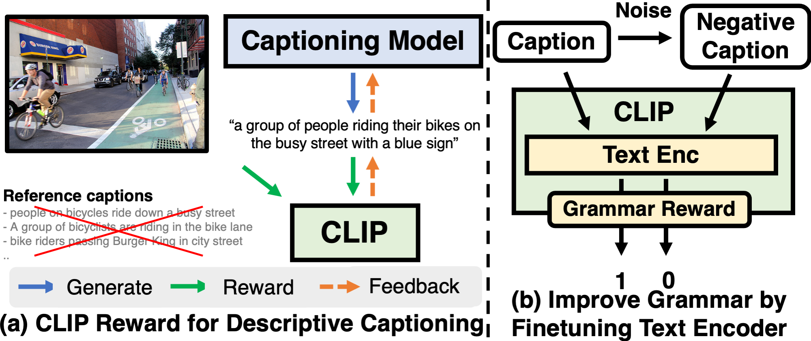

# Fine-grained Image Captioning with CLIP Reward

* Authors: [Jaemin Cho](https://j-min.io), [David Seunghyun Yoon](https://david-yoon.github.io/), [Ajinkya Kale](https://www.linkedin.com/in/kaleajinkya/), [Franck Dernoncourt](https://research.adobe.com/person/franck-dernoncourt), [Trung Bui](https://sites.google.com/site/trungbuistanford/), [Mohit Bansal](https://www.cs.unc.edu/~mbansal/)
* [Findings of NAACL 2022 Paper](https://arxiv.org/abs/2205.13115)
* [](https://colab.research.google.com/drive/1pcXci44C421_m1DeByATSBEeM1JXO7DJ) (Inference using pretrained model on custom image)




# Code structure
```bash
# Configurations
./configs/
    # MLE
    phase1/
    # RL
    phase2/

# COCO caption evaluation
./cider
./coco-caption

# Pretrained CLIP as feature extractor
./clip

# Core model / data processing code
./captioning

# Training/Evaluation script (python)
./tools

# Training/Evaluation script (bash)
./scripts

# Training/Evaluation script for FineCapEval (bash)
./scripts_FineCapEval

# Fine-tuning CLIP Text encoder
./retrieval

# Pretrained checkpoints
./save

# Storing preprocessed features
./data

# Storing original dataset files
./datasets
```

# Setup

## Install Dependencies


```bash
# Create python environment (optional)
conda create -n clip4caption python=3.7
source activate clip4caption

# python dependenceies
pip install -r requirements.txt

## Install this repo as package
pip install -e .

# Install Detectron2 (optional for training utilities)
pip install detectron2 -f https://dl.fbaipublicfiles.com/detectron2/wheels/cu113/torch1.10/index.html

# Setup coco-caption (optional for text metric evaluation)
git clone https://github.com/clip-vil/cider
git clone https://github.com/clip-vil/coco-caption
bash get_stanford_models.sh
bash get_google_word2vec_model.sh

# Install java (optional for METEOR evaluation as part of text metrics)
sudo apt install default-jre
```


## Download Pretrained models
We host model checkpoints via [google drive](https://drive.google.com/drive/folders/1-1BQbBlwwDzcqX1iMPn7UpjTeGYtAUfT)
Place checkpoints like as below. The `.ckpt` file size for captioning and CLIP models are 669.65M and 1.12G, respectively.
```bash
# Captioning model
./save/
    clipRN50_cider/
        clipRN50_cider-last.ckpt
    clipRN50_cider_clips/
        clipRN50_cider_clips-last.ckpt
    clipRN50_clips/
        clipRN50_clips-last.ckpt
    clipRN50_clips_grammar/
        clipRN50_clips_grammar-last.ckpt
    clipRN50_mle/
        clipRN50_mle-last.ckpt

# Finetuned CLIP
./retrieval/
    save/
        clip_negative_text-last.ckpt
```


# Dataset preparation


```
# Original dataset files - to be downloaded
./datasets
    COCO/
        # download from MS COCO
        images/
            train2014/
            val2014/
        # download from MS COCO
        annotations/
            captions_train2014.json
            captions_val2014.json

    FineCapEval/
        images/
            XXX.jpg
```

## MS COCO

* Download files
```bash
./datasets/
    # Download images and annotations from http://mscoco.org/dataset/#download
     COCO/
        images/
            train2014/
            val2014/
        annotations/
            captions_train2014.json
            captions_val2014.json


./data/
    # Download from http://cs.stanford.edu/people/karpathy/deepimagesent/caption_datasets.zip
    dataset_coco.json

    # Download from from https://drive.google.com/drive/folders/1eCdz62FAVCGogOuNhy87Nmlo5_I0sH2J
    coco-train-words.p
```

* Text processing
```bash
python scripts/prepro_labels.py --input_json data/dataset_coco.json --output_json data/cocotalk.json --output_h5 data/cocotalk
```

* Visual feature extraction
```bash
python scripts/clip_prepro_feats.py --input_json data/dataset_coco.json --output_dir data/cocotalk --images_root datasets/COCO/images --model_type RN50

# optional (n_jobs)
--n_jobs 4 --job_id 0
```


* Visual fetaure extraction
```bash
python scripts/clipscore_prepro_feats.py --input_json data/dataset_coco.json --output_dir data/cocotalk --images_root datasets/COCO/images

# optional (n_jobs)
--n_jobs 4 --job_id 0
```

## FineCapEval
* Download files from https://drive.google.com/drive/folders/1jlwInAsVo-PdBdJlmHKPp34dLnxIIMLx?usp=sharing
```bash
.data/
    FineCapEval.csv

# Download from https://drive.google.com/drive/folders/1jlwInAsVo-PdBdJlmHKPp34dLnxIIMLx?usp=sharing
FineCapEval/
        images/
            XXX.jpg
```

* Visual feature extraction
```bash
python scripts_FineCapEval/clip_prepro_feats.py --input_json data/FineCapEval.json --output_dir data/FineCapEval --images_root datasets/FineCapEval/images --model_type RN50

# optional (n_jobs)
--n_jobs 4 --job_id 0
```

# Training and Evaluation

## 1) MLE training
```bash
export MLE_ID='clipRN50_mle'

# Training
python tools/train_pl.py --cfg configs/phase1/$MLE_ID.yml --id $MLE_ID

# Evaluation
EVALUATE=1 python tools/train_pl.py --cfg configs/phase1/$MLE_ID.yml --id $MLE_ID

# Text-to-Iage Retrieval with CLIP VIT-B/32
python tools/eval_clip_retrieval.py --gen_caption_path "./eval_results/$MLE_ID.json"

# Evaluation on FineCapEval
python tools/finecapeval_inference.py --reward mle
python tools/eval_finecapeval.py --generated_id2caption ./FineCapEval_results/clipRN50_mle.json
```

## 2) RL finetuning

### Reward: CIDEr

```bash
export REWARD='cider'
export MLE_ID='clipRN50_mle'
export RL_ID='clipRN50_'$REWARD

# Copy MLE checkpoint as starting point of RL finetuning
mkdir save/$RL_ID
cp save/$MLE_ID/$MLE_ID-last.ckpt save/$RL_ID/$RL_ID-last.ckpt

# Training
python tools/train_pl.py --cfg configs/phase2/$RL_ID.yml --id $RL_ID

# Evaluation
EVALUATE=1 python tools/train_pl.py --cfg configs/phase2/$RL_ID.yml --id $RL_ID

# Text-to-Iage Retrieval with CLIP VIT-B/32
python tools/eval_clip_retrieval.py --gen_caption_path "./eval_results/$RL_ID.json"

# Evaluation on FineCapEval
python tools/finecapeval_inference.py --reward $REWARD
python tools/eval_finecapeval.py --generated_id2caption ./FineCapEval_results/$RL_ID.json
```

### Reward: CLIP-S
```bash
export REWARD='clips'
export MLE_ID='clipRN50_mle'
export RL_ID='clipRN50_'$REWARD

# Copy MLE checkpoint as starting point of RL finetuning
mkdir save/$RL_ID
cp save/$MLE_ID/$MLE_ID-last.ckpt save/$RL_ID/$RL_ID-last.ckpt

# Training
python tools/train_pl.py --cfg configs/phase2/$RL_ID.yml --id $RL_ID

# Evaluation
EVALUATE=1 python tools/train_pl.py --cfg configs/phase2/$RL_ID.yml --id $RL_ID

# Text-to-Iage Retrieval with CLIP VIT-B/32
python tools/eval_clip_retrieval.py --gen_caption_path "./eval_results/$RL_ID.json"

# Evaluation on FineCapEval
python tools/finecapeval_inference.py --reward $REWARD
python tools/eval_finecapeval.py --generated_id2caption ./FineCapEval_results/$RL_ID.json
```

### Reward: CLIP-S + CIDEr
```bash
export REWARD='clips_cider'
export MLE_ID='clipRN50_mle'
export RL_ID='clipRN50_'$REWARD

# Copy MLE checkpoint as starting point of RL finetuning
mkdir save/$RL_ID
cp save/$MLE_ID/$MLE_ID-last.ckpt save/$RL_ID/$RL_ID-last.ckpt

# Training
python tools/train_pl.py --cfg configs/phase2/$RL_ID.yml --id $RL_ID

# Evaluation
EVALUATE=1 python tools/train_pl.py --cfg configs/phase2/$RL_ID.yml --id $RL_ID

# Text-to-Iage Retrieval with CLIP VIT-B/32
python tools/eval_clip_retrieval.py --gen_caption_path "./eval_results/$RL_ID.json"

# Evaluation on FineCapEval
python tools/finecapeval_inference.py --reward $REWARD
python tools/eval_finecapeval.py --generated_id2caption ./FineCapEval_results/$RL_ID.json
```


### Reward: CLIP-S + Grammar
1) Run CLIP Finetuning (for grammar) following [./retrieval/README.md](./retrieval/README.md)

2) Run RL training using the updated CLIP
```bash
export REWARD='clips_grammar'
export MLE_ID='clipRN50_mle'
export RL_ID='clipRN50_'$REWARD

# Copy MLE checkpoint as starting point of RL finetuning
mkdir save/$RL_ID
cp save/$MLE_ID/$MLE_ID-last.ckpt save/$RL_ID/$RL_ID-last.ckpt

# Training
python tools/train_pl.py --cfg configs/phase2/$RL_ID.yml --id $RL_ID

# Evaluation
EVALUATE=1 python tools/train_pl.py --cfg configs/phase2/$RL_ID.yml --id $RL_ID

# Text-to-Iage Retrieval with CLIP VIT-B/32
python tools/eval_clip_retrieval.py --gen_caption_path "./eval_results/$RL_ID.json"

# Evaluation on FineCapEval
python tools/finecapeval_inference.py --reward $REWARD
python tools/eval_finecapeval.py --generated_id2caption ./FineCapEval_results/$RL_ID.json
```


# Acknowledgments
We thank the developers of [CLIP-ViL](https://github.com/clip-vil/CLIP-ViL/tree/master/CLIP-ViL-Direct/caption), [ImageCaptioning.pytorch](https://github.com/ruotianluo/ImageCaptioning.pytorch), [CLIP](https://github.com/openai/CLIP), [coco-caption](https://github.com/tylin/coco-caption), [cider](https://github.com/vrama91/cider) for their public code release.


# Reference
Please cite our paper if you use our models in your works:


```bibtex
@inproceedings{Cho2022CLIPReward,
  title     = {Fine-grained Image Captioning with CLIP Reward},
  author    = {Jaemin Cho and Seunghyun Yoon and Ajinkya Kale and Franck Dernoncourt and Trung Bui and Mohit Bansal},
  booktitle = {Findings of NAACL},
  year      = {2022}
}